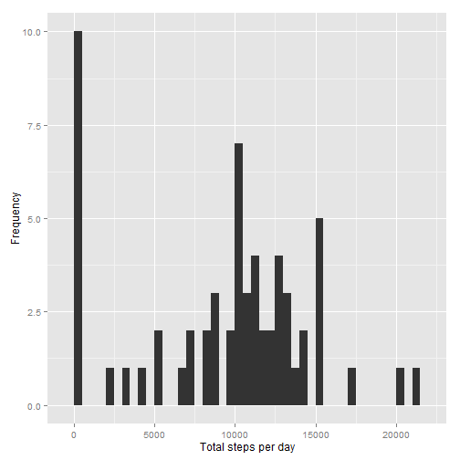
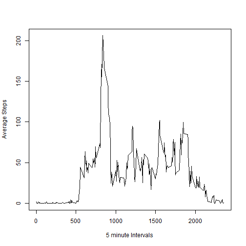
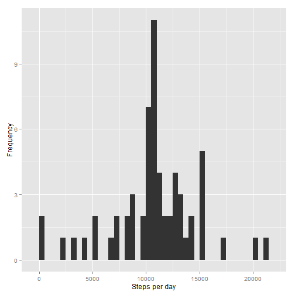
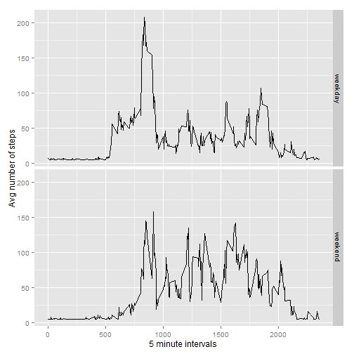

**Q1 What is mean total number of steps taken per day?**

*Read the Activity data into R*


```r
activitydata <- read.csv('activity.csv')
```

*Aggregate the Steps by Date*


```r
StepsbyDate <- tapply(activitydata$steps, activitydata$date, sum, na.rm =TRUE)
```

*Plot the Steps per Day data*

```r
library("ggplot2")
qplot(StepsbyDate, xlab='Total steps per day', ylab='Frequency', binwidth=500)
```

 

*Mean and Median for the total number of Steps per day*

```r
mean(StepsbyDate, na.rm=TRUE)
```

```
## [1] 9354.23
```

```r
median(StepsbyDate, na.rm=TRUE)
```

```
## [1] 10395
```

**Q2 What is the average daily activity pattern?**

*Calculate Average steps by Interval*

```r
StepsbyInterval <- aggregate(data=activitydata, steps~interval, FUN=mean, na.action=na.omit)
```

*Generate Time Series Plot of the Average Steps by Interval Data*

```r
with(StepsbyInterval,{plot(x=interval, y=steps, type="l", xlab="5 minute Intervals", ylab="Average Steps")})
```

 

**Q3 Interval with maximum number of steps**


```r
StepsbyInterval[StepsbyInterval$steps==max(StepsbyInterval$steps),]
```

```
##     interval    steps
## 104      835 206.1698
```

**Q4 Counting and Inputing missing values**

*Number of missing values in the dataset*

```r
sum(is.na(activitydata$steps))
```

```
## [1] 2304
```

*Replace the missing values with the mean of steps across all days across all time intervals*

```r
activitydata$steps[which(is.na(activitydata$steps))] <- mean(activitydata$steps, na.rm = TRUE)
```

**Q5 Histogram of the total number of steps taken each day**

```r
ActDatawithoutNAs <- tapply(activitydata$steps, activitydata$date, sum)
qplot(ActDatawithoutNAs, xlab='Steps per day', ylab='Frequency', binwidth=500)
```

 

**Q6 Mean and Median of the total steps per day after replacing NAs**

```r
mean(ActDatawithoutNAs)
```

```
## [1] 10766.19
```

```r
median(ActDatawithoutNAs)
```

```
## [1] 10766.19
```

**Q7 Are there differences in activity patterns between weekdays and weekends?**

*Create a factor variable for weekday and weekend*

```r
activitydata$datetype <- ifelse(as.POSIXlt(activitydata$date)$wday %in% c(0,6), 'weekend', 'weekday')
```
*Aggregate the Activity Data with the new factor variable*

```r
Activity_Avg <- aggregate(steps~interval + datetype, data = activitydata, mean)
```
*Panel plot containing a time series plot*

```r
ggplot(Activity_Avg, aes(interval, steps)) + geom_line() + facet_grid(datetype ~ .) +  xlab("5 minute intervals") +  ylab("Avg number of steps")
```

 


